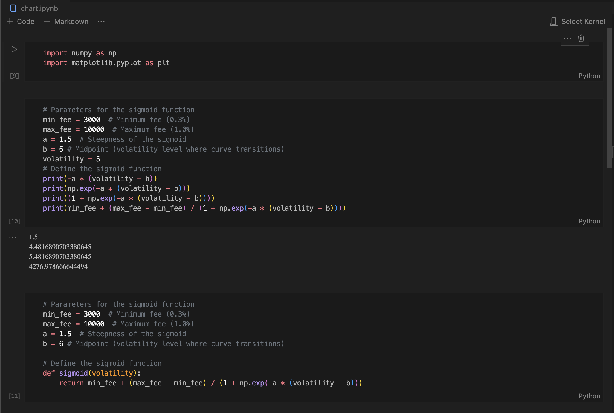
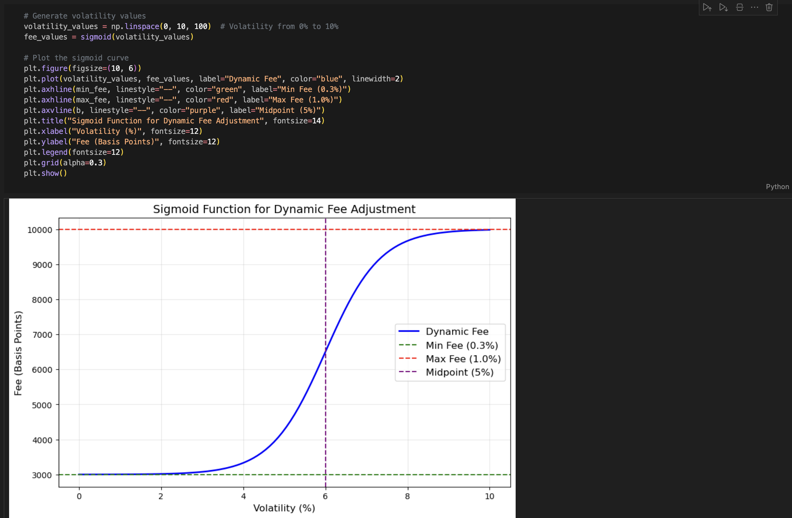

# Best fee hook
Dynamic fee based on asset volatility. Made as part of UHI3 cohort from Atrium.


## **Description**

Our project, the Best Fee Hook for Uniswap V4, is meant to make fees better by looking into the volatility of the asset to make fees cheaper or more expensive.

The idea is to make fees much more dynamic by creating a relationship with market factors like volatility.

In this case the volatility of last 7 days is compared against last 24 hours to assess if is increasing or decreasing. This is used to tune the sigmoid function to return higher fees (if 24 hours volatility is higher) or vice-versa.

This is only a glimpse of what's possible.

We believe most of the pools will have dynamic fees in the future as they will creater better incentives for LPs and swapers.

## **Problem**

Volatility serves as a key indicator of investment risk. Higher volatility, generally implies:

- Greater uncertainty in asset values.
- Increased potential for both gains and losses.
- A need for more careful risk management strategies.

Volatility can harm LPs with impermanent loss.

## **Impact**

There is a need for incentives in high volatiliy times, by making fees dynamic based on volatility we increase fees on high volatility times making pools more attractive to LPs.

## **Integrations**

We integrated chainlink volatility feed to access volatility data.

## **Challenges**

The biggest challenge was working fixed-point numbers.

## **Extension**

We can take into account other market factors like swap volume, gas fees and liquidity.

## **Team**

Leonardo Berteotti (@berteotti) & Diogo Ferreira (@diogomartf)

---

## Visualize it with Jupiter notebook

Open `chart.ipynb`file on vscode editor.




---

## How to run it

### Foundry

Foundry is a blazing fast, portable and modular toolkit for Ethereum application development written in Rust.

## Documentation

https://book.getfoundry.sh/

## Usage

### Build

```shell
$ forge build
```

### Test

```shell
$ forge test
```

### Format

```shell
$ forge fmt
```

### Gas Snapshots

```shell
$ forge snapshot
```

### Anvil

```shell
$ anvil
```

### Deploy

```shell
$ forge script script/BestFeesHook.s.sol:CounterScript --rpc-url <your_rpc_url> --private-key <your_private_key>
```